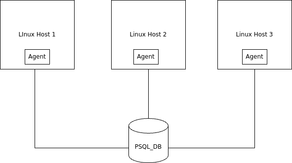

# Linux Cluster Monitoring Agent
This project is under development. Since this project follows the GitFlow, the final work will be merged to the main branch after Team Code Team.
|

# Introduction
The Jarvis Linux Cluster Administration (LCA) project is designed to monitor and record hardware specifications and resource usage data of a Linux cluster consisting of multiple nodes. The primary users of this project are the LCA team, who need to manage and optimize the cluster's performance for future resource planning. The project leverages several technologies, including Bash for scripting, Docker for containerizing the PostgreSQL database, and Git for version control. The system involves two main scripts: host_info.sh to collect static hardware information and host_usage.sh to monitor real-time CPU and memory usage.

# Quick Start

#### Start a PostgreSQL instance using psql_docker.sh
```  
./scripts/psql_docker.sh start
```

#### Create tables using ddl.sql
```
psql -h localhost -p 5432 -d host_agent -U postgres -f sql/ddl.sql
```

#### Insert hardware specs data into the DB using host_info.sh
```
./scripts/host_info.sh "localhost" 5432 "host_agent" "postgres" "password"
```

#### Insert hardware usage data into the DB using host_usage.sh
```
./scripts/host_usage.sh "localhost" 5432 "host_agent" "postgres" "password"
```

#### Setup crontab for periodic data collection
```
crontab -e
```

#### Add the following line to run host_usage.sh every minute
```
* * * * * /path/to/scripts/host_usage.sh "localhost" 5432 "host_agent" "postgres" "password" > /tmp/host_usage.log
```

# Implementation

## Architecture
Cluster Diagram with three Linux hosts, a DB, and agents.



## Scripts

psql_docker.sh: A script to manage the PostgreSQL Docker container
```sh
./scripts/psql_docker.sh start|stop|create
```

host_info.sh: A script to collect and insert hardware specification data into the PostgreSQL database.
```sh
./scripts/host_info.sh psql_host psql_port db_name psql_user psql_password
```

host_usage.sh: A script to collect and insert real-time CPU and memory usage data into the PostgreSQL database.
```sh
./scripts/host_usage.sh psql_host psql_port db_name psql_user psql_password
```

crontab: Cron job setup to automate the periodic execution of host_usage.sh.

queries.sql: Contains SQL queries to generate reports and analyze the collected data. These queries help resolve business problems such as identifying underutilized servers or planning for capacity upgrades.

## Database Modeling

### `host_info` Table

| Column Name        | Data Type | Description                      |
|--------------------|-----------|----------------------------------|
| id                 | SERIAL    | Primary key                      |
| hostname           | VARCHAR   | The name of the host             |
| cpu_number         | INTEGER   | Number of CPUs                   |
| cpu_architecture   | VARCHAR   | CPU architecture                 |
| cpu_model          | VARCHAR   | CPU model name                   |
| cpu_mhz            | REAL      | CPU frequency in MHz             |
| l2_cache           | INTEGER   | L2 cache size in KB              |
| total_mem          | INTEGER   | Total memory in MB               |
| timestamp          | TIMESTAMP | Time of recording                |


### `host_usage` Table

| Column Name  | Data Type | Description                      |
|--------------|-----------|----------------------------------|
| id           | SERIAL    | Primary key                      |
| hostname     | VARCHAR   | The name of the host             |
| memory_free  | INTEGER   | Free memory in MB                |
| cpu_idle     | REAL      | CPU idle percentage              |
| cpu_kernel   | REAL      | CPU kernel percentage            |
| disk_io      | INTEGER   | Disk I/O in KB                   |
| disk_available| INTEGER  | Available disk space in MB       |
| timestamp    | TIMESTAMP | Time of recording                |

# Test
The Bash scripts and SQL DDL were manually tested to verify their functionality. The scripts were executed on a test server, and the resulting data was checked to ensure correctness. The database tables were validated by querying the inserted data to confirm that all fields were correctly populated. 

# Deployment
The project was deployed using the following steps:
- **GitHub:** The source code was managed using Git and hosted on GitHub for version control and collaboration.
- **Docker:** The PostgreSQL database was containerized using Docker, ensuring a consistent environment.
- **Crontab:** To ensure continuous data collection, the `host_usage.sh` script needs to be executed every minute. This can be automated using `crontab`.

## Deploy/Automate `host_usage.sh` using crontab

### Step-by-Step Instructions:

1. **Edit Crontab Jobs:**
    Open the crontab editor by running the following command:
   ```bash
   crontab -e.
   ```
2. **Add Crontab Entry:**
    Add the following entry to the crontab file. Make sure to use the correct file location for your script:
    ```bash
     * * * * * bash /home/centos/dev/jrvs/bootcamp/linux_sql/host_agent/scripts/host_usage.sh localhost 5432 host_agent      postgres password > /tmp/host_usage.log
    ```
3. **List Crontab Jobs:**
    To verify the crontab jobs, use:
    ```bash
    crontab -l
    ```

4. **Validate Your Results:**
    Connect to your PostgreSQL instance and query the host_usage table to ensure data is being collected every minute:
    ```bash
    psql -h localhost -p 5432 -d host_agent -U postgres
    ```
    ```sql
    SELECT * FROM host_usage;
    ```


    


